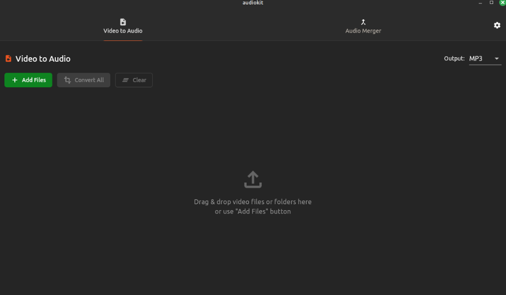

# AudioKit 🎵

AudioKit is a high-performance Flutter Linux desktop application designed for batch **Video-to-Audio conversion** and **Audio Merging**. It features a modern Ubuntu-style UI (using Yaru) and provides real-time progress tracking and process management for all operations.



## ✨ Features

- **Video to Audio Conversion**: 
    - Batch process multiple video files.
    - Support for multiple output formats (Opus, MP3, HE-AAC).
    - Real-time progress percentage and ETA display.
    - Per-file cancellation and "Cancel All" functionality.
- **Audio Merger**: 
    - Merge multiple audio files into a single track.
    - Drag-and-drop to reorder tracks.
    - Progress tracking during standardization and concatenation phases.
    - Merge cancellation support.
- **Modern Linux UX**:
    - Native Yaru theme integration.
    - Drag-and-drop folder and file imports.
    - Intelligent folder scanning with file type filtering.
    - Clean, dark-mode optimized interface.

## 🛠️ Prerequisites

AudioKit requires **FFmpeg** to be installed on your system.

```bash
# Ubuntu/Debian
sudo apt update && sudo apt install ffmpeg

# Fedora
sudo dnf install ffmpeg

# Arch Linux
sudo pacman -S ffmpeg
```

## 📦 Download & Installation

### Debian/Ubuntu (.deb)

You can install the latest release using the `.deb` package:

```bash
# Install the package
sudo dpkg -i dist/1.0.0+1/audiokit-1.0.0+1-linux.deb

# Fix missing dependencies (if any)
sudo apt-get install -f
```

## 🚀 Getting Started (Development)

### Clone the repository
```bash
git clone git@github.com:JoelV1234/audio-kit.git
cd audio-kit
```

### Run the application
```bash
flutter pub get
flutter run -d linux
```

### Build for Release
```bash
flutter build linux --release
```

## 🏗️ Project Structure

- `lib/services/`: Core FFmpeg process management and progress parsing.
- `lib/widgets/`: Yaru-styled UI components and tab implementations.
- `lib/models/`: Data models for media processing state.

## 🧰 Tech Stack

- **Framework**: [Flutter](https://flutter.dev) (Desktop)
- **UI Architecture**: [Yaru](https://pub.dev/packages/yaru) (Ubuntu design system)
- **Engine**: [FFmpeg](https://ffmpeg.org)
- **Key Plugins**: `desktop_drop`, `file_picker`, `path_provider`, `window_manager`.

## 📜 License

This project is open source. See the LICENSE for details (if any).

